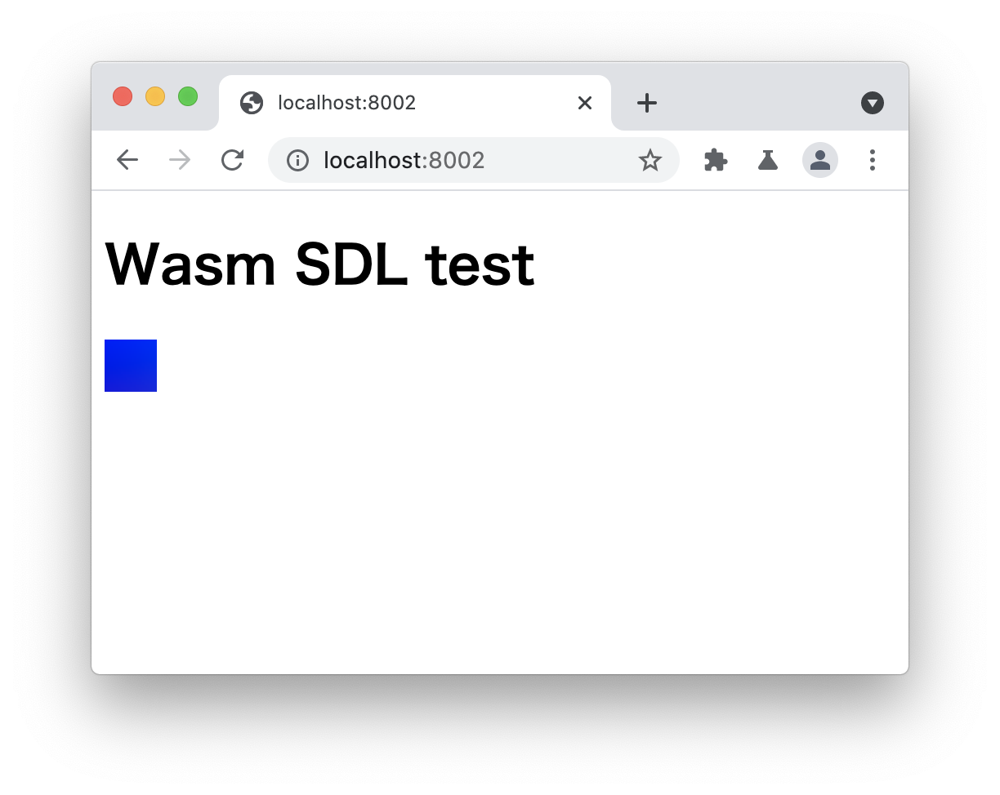

# wasm-sdl-test

## Build
```
cd build
emcmake cmake ..
emmake make
cd ..
```
So, it will generate `build/main.js`.

## Run
```
python3 -m http.server 8002
```
And if you access `http://localhost:8002/`, you will see this:


